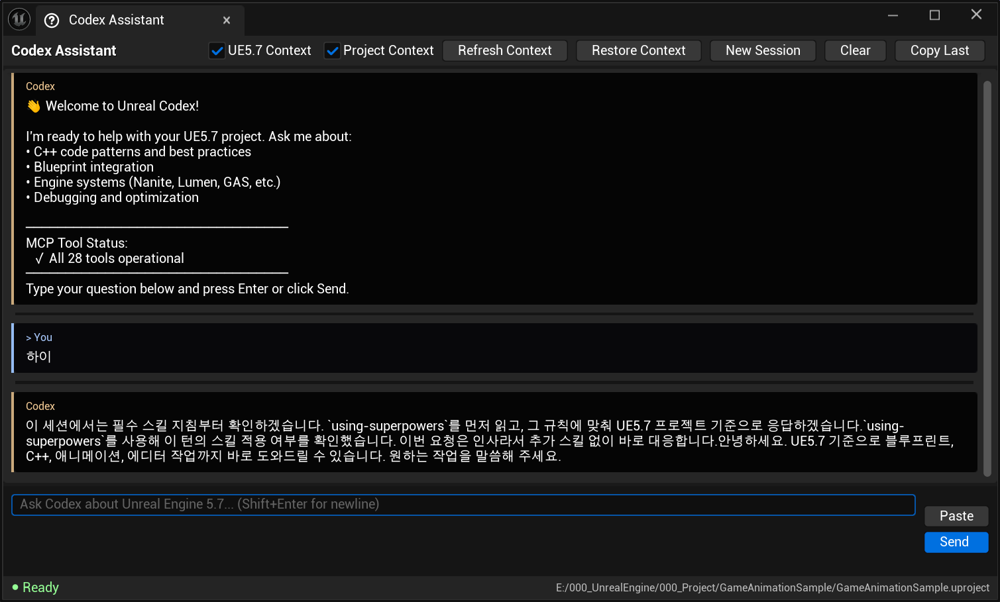

# UnrealCodex


**OpenAI Codex CLI integration for Unreal Engine 5.7** - Get AI coding assistance directly in the editor with built-in UE5.7 documentation context.

Language: English | [한국어](README.ko.md)

> **Supported Platforms:** Windows (Win64), Linux, and macOS (Apple Silicon). Codex CLI on Windows is still less battle-tested than Linux/macOS.

## Overview

UnrealCodex integrates the [OpenAI Codex CLI](https://developers.openai.com/codex/cli) directly into the Unreal Engine 5.7 Editor. Instead of using the API directly, this plugin shells out to the `codex` command-line tool, leveraging your existing Codex authentication and capabilities.



**Key Features:**
- **Native Editor Integration** - Chat panel docked in your editor with live streaming responses, tool call grouping, and code block rendering
- **MCP Server** - 20+ Model Context Protocol tools for actor manipulation, Blueprint editing, level management, materials, input, and more
- **Dynamic UE 5.7 Context System** - The MCP bridge includes a dynamic context loader that provides accurate UE 5.7 API documentation on demand
- **Blueprint Editing** - Create and modify Blueprints, Animation Blueprints, and state machines (still experimental, so verify results before relying on them)
- **Level Management** - Open, create, and manage levels and map templates programmatically
- **Asset Management** - Search assets, query dependencies and referencers
- **Async Task Queue** - Long-running operations won't timeout
- **Script Execution** - Codex can write, compile (via Live Coding), and execute scripts with your permission
- **Session Persistence** - Conversation history saved across editor sessions
- **Project-Aware** - Automatically gathers project context such as modules, plugins, assets, and editor viewport state
- **Uses Codex Authentication** - No separate API key management is required

## Prerequisites

### 1. Install Codex CLI

```bash
npm i -g @openai/codex
```

### 2. Authenticate Codex CLI

```bash
codex login
```

This opens an authentication flow for your ChatGPT/Codex account (or API key mode if configured).

### 3. Verify Installation

```bash
codex --version
codex exec --skip-git-repo-check "Reply with OK"
```

## Installation

(Check the Editor category in the plugin browser. You may need to scroll down if search does not surface it.)

### Step 1: Clone and Build

This plugin must be built from source for your platform and engine version. No prebuilt binaries are included.

1. Clone this repository (includes the MCP bridge submodule):
   ```bash
   git clone --recurse-submodules https://github.com/online5880/UnrealCodex.git
   ```
   If you already cloned without `--recurse-submodules`, run:
   ```bash
   cd UnrealCodex
   git submodule update --init
   ```

2. Build the plugin:

   **Windows:**
   ```bash
   Engine\Build\BatchFiles\RunUAT.bat BuildPlugin -Plugin="PATH\TO\UnrealCodex\UnrealCodex\UnrealCodex.uplugin" -Package="OUTPUT\PATH" -TargetPlatforms=Win64
   ```

   **Linux:**
   ```bash
   Engine/Build/BatchFiles/RunUAT.sh BuildPlugin -Plugin="/path/to/UnrealCodex/UnrealCodex/UnrealCodex.uplugin" -Package="/output/path" -TargetPlatforms=Linux
   ```

   **macOS:**
   ```bash
   Engine/Build/BatchFiles/RunUAT.sh BuildPlugin -Plugin="/path/to/UnrealCodex/UnrealCodex/UnrealCodex.uplugin" -Package="/output/path" -TargetPlatforms=Mac
   ```

### Step 2: Install the Plugin

Copy the built plugin to either your **project** or **engine** plugins folder.

**Option A: Project Plugin (Recommended)**

Copy the build output to your project's `Plugins` directory:
```
YourProject/
├── Content/
├── Source/
└── Plugins/
    └── UnrealCodex/
        ├── Binaries/
        ├── Source/
        ├── Resources/
        ├── Config/
        └── UnrealCodex.uplugin
```

**Option B: Engine Plugin (All Projects)**

Copy to your engine's plugins folder:

**Windows:**
```
C:\Program Files\Epic Games\UE_5.7\Engine\Plugins\Marketplace\UnrealCodex\
```

**Linux:**
```
/path/to/UnrealEngine/Engine/Plugins/Marketplace/UnrealCodex/
```

### Step 3: Install MCP Bridge Dependencies

Required for Blueprint tools and editor integration:
```bash
cd <PluginPath>/UnrealCodex/Resources/mcp-bridge
npm install
```

### Step 4: Launch

Launch the editor - the plugin will load automatically.

## macOS Quick Start (Apple Silicon)

For full details, see [INSTALL_MAC.md](INSTALL_MAC.md).

1. **Install Node.js and Codex CLI:**
   ```bash
   brew install node
   npm i -g @openai/codex
   codex login
   ```
2. **Install the plugin** into your project's `Plugins/` directory
3. **Install MCP bridge dependencies:**
   ```bash
   cd YourProject/Plugins/UnrealCodex/Resources/mcp-bridge
   npm install
   ```
4. **Launch** the editor and open **Tools > Codex Assistant**

## Linux Quick Start (Rocky/Fedora)

For full details, see [INSTALL_LINUX.md](INSTALL_LINUX.md).

1. **Install Libraries:**
   ```bash
   sudo dnf install -y nss nspr mesa-libgbm libXcomposite libXdamage libXrandr alsa-lib pciutils-libs libXcursor atk at-spi2-atk pango cairo gdk-pixbuf2 gtk3
   ```
2. **Install Clipboard Support:**
   ```bash
   sudo dnf install -y wl-clipboard   # Wayland
   sudo dnf install -y xclip          # X11 fallback
   ```
3. **Setup Wayland:**
   ```bash
   export SDL_VIDEODRIVER=wayland
   export UE_Linux_EnableWaylandNative=1
   ```
4. **Build and Launch:**
   ```bash
   ./UnrealEditor -vulkan
   ```

## Usage

### Opening the Codex Panel

Menu -> Tools -> Codex Assistant

### Example Prompts

```
How do I create a custom Actor Component in C++?

What's the best way to implement a health system using GAS?

Explain World Partition and how to set up streaming for an open world.

Write a BlueprintCallable function that spawns particles at a location.

How do I properly use TObjectPtr<> vs raw pointers in UE5.7?
```

### Input Shortcuts

| Shortcut | Action |
|----------|--------|
| `Enter` | Send message |
| `Shift+Enter` | New line in input |
| `Escape` | Cancel current request |

## Features

### Session Persistence

Conversations are automatically saved to your project's `Saved/UnrealCodex/` directory and restored when you reopen the editor. The plugin maintains conversation context across sessions.

### Project Context

UnrealCodex automatically gathers information about your project:
- Source modules and their dependencies
- Enabled plugins
- Project settings
- Recent assets
- Custom CLAUDE.md instructions

### MCP Server

The plugin includes a Model Context Protocol (MCP) server with 20+ tools that expose editor functionality to Codex and external tools. The MCP server runs on port 3000 by default and starts automatically when the editor loads.

**Tool Categories:**
- **Actor Tools** - Spawn, move, delete, inspect, and set properties on actors
- **Level Management** - Open levels, create new levels from templates, list available templates
- **Blueprint Tools** - Create and modify Blueprints (variables, functions, nodes, pins)
- **Animation Blueprint Tools** - Full state machine editing (states, transitions, conditions, batch operations)
- **Asset Tools** - Search assets, query dependencies and referencers with pagination
- **Character Tools** - Character configuration, movement settings, and data queries
- **Material Tools** - Material and material instance operations
- **Enhanced Input Tools** - Input action and mapping context management
- **Utility Tools** - Console commands, output log, viewport capture, script execution
- **Async Task Queue** - Background execution for long-running operations

For full MCP tool documentation with parameters, examples, and API details, see [UnrealCodex MCP Bridge](https://github.com/online5880/UnrealCodex/tree/master/UnrealCodex/Resources/mcp-bridge).

#### Dynamic UE 5.7 Context System

The MCP bridge includes a dynamic context loader that provides accurate UE 5.7 API documentation on demand. Use `unreal_get_ue_context` to query by category (animation, blueprint, slate, actor, assets, replication) or search by keywords. Context status is shown in `unreal_status` output.

## Configuration

### Custom System Prompts

You can extend the built-in UE5.7 context by creating a `CLAUDE.md` file in your project root.
Starter templates are available at `UnrealCodex/CLAUDE.md.default` and `UnrealCodex/CODEX.md.default`:

```markdown
# My Project Context

## Architecture
- This is a multiplayer survival game
- Using Dedicated Server model
- GAS for all abilities

## Coding Standards
- Always use UPROPERTY for Blueprint access
- Prefix interfaces with I (IInteractable)
- Use GameplayTags for ability identification
```

### Allowed Tools

By default, the plugin runs Codex with these tools available through its runtime policy. You can adjust runtime/tool behavior in `UnrealCodex/Source/UnrealCodex/Private/CodexSubsystem.cpp` and `UnrealCodex/Source/UnrealCodex/Private/CodexCodeRunner.cpp`.

### MCP Server IDs

Codex examples use the MCP server ID `unrealcodex`.

```cpp
Config.AllowedTools = { TEXT("Read"), TEXT("Grep"), TEXT("Glob") }; // Read-only
```

## How It Works

1. User enters a prompt in the editor widget
2. Plugin builds context from UE5.7 knowledge + project information
3. Executes Codex non-interactively via `codex exec` with JSON event streaming
4. Codex runs with your project as the working directory
5. Response is captured and displayed in the chat panel
6. Conversation is persisted for future sessions

### Command Line Equivalent

```bash
cd "C:\YourProject"
codex exec --json --skip-git-repo-check \
  "How do I create a custom GameMode?"
```

## Troubleshooting

### "Codex CLI not found"

1. Verify Codex is installed: `codex --version`
2. Check it's in your PATH: `where codex` (Windows) / `which codex` (Linux)
3. Restart Unreal Editor after installation

### "Authentication required"

Run `codex login` in a terminal to authenticate.

### Responses are slow

Codex executes in your project directory and may read files for context. Large projects may have slower initial responses.

You might also have too many global agent plugins enabled (i.e. Superpowers, ralp-loop, context7). The context for those plugins 
getting injected can cause slowdowns up to 3+ minutes. 

### Plugin doesn't compile

Ensure you're on Unreal Engine 5.7. Supported platforms are Windows (Win64), Linux, and macOS.

### MCP Server not starting

Check if port 3000 is available. The MCP server logs to `LogUnrealCodex`.

### MCP tools not available / Blueprint tools not working

If Codex reports that MCP tools are configured but unavailable:

1. **Install MCP bridge dependencies**: The most common cause is missing npm packages:
   ```bash
   cd YourProject/Plugins/UnrealCodex/Resources/mcp-bridge
   npm install
   ```

2. **Verify the HTTP server is running**: With the editor open, test:
   ```bash
   curl http://localhost:3000/mcp/status
   ```
   You should see a JSON response with project info.

3. **Check the Output Log**: Look for `LogUnrealCodex` messages:
   - `MCP Server started on http://localhost:3000` - Server is running
   - `Registered X MCP tools` - Tools are loaded

4. **Restart the editor**: After installing npm dependencies, restart Unreal Editor.

### Debugging the MCP Bridge

The MCP bridge is also available as a [standalone repository](https://github.com/Natfii/ue5-mcp-bridge) with its own Vitest test suite. If you're experiencing bridge-level issues (tool listing, parameter translation, context injection), you can run the bridge tests independently:

```bash
cd path/to/ue5-mcp-bridge
npm install
npm test
```

This tests the bridge without requiring a running Unreal Editor.


## Contributing

Feel free to fork for your own needs! Possible areas for improvement:

- [x] Linux support (thanks [@bearyjd](https://github.com/bearyjd))
- [x] Mac support (thanks [@lateralsummer](https://github.com/lateralsummer))
- [ ] Additional MCP tools (the current toolset still needs refactoring, so no new tools for now)

## License

MIT License - See [LICENSE](UnrealCodex/LICENSE) file.

## Credits

- Built for Unreal Engine 5.7
- Integrates with [OpenAI Codex CLI](https://developers.openai.com/codex/cli)
